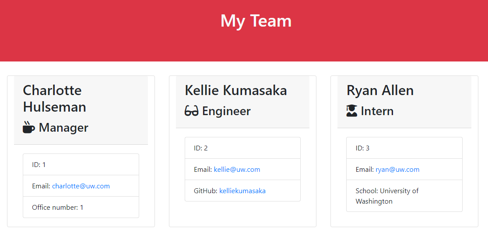

# Team Profile Generator



## Table of Contents

- [Project Description](./newREADME#project-description)
- [Installation Guide](./newREADME#installation-guide)
- [Usage Information](./newREADME#usage-information)
- [Contribution Guidelines](./newREADME#contribution-guidelines)
- [Test Instructions](./newREADME#test-instructions)
- [Questions](./newREADME#questions)

## Project Description:
This project is designed to easily and quickly generate a Team Profile page via command prompt responses

## Installation Guide:
You will need Node.js installed on your pc to run this program. 

To install, simply clone the repository and in cmd, type ```npm i```.

Your pc will proceed to install the necessary modules for the program to run.

## Usage Information:
Video Tutorial: https://youtu.be/Zq2-hA0g16Q

To use the program, simply type in your command line ```node index.js```.

You will then be prompted for the name, id, email, and office number of the manager of the team. 

Once you fill out that information, you will be prompted to choose to add either an Engineer or an Intern to the team, after which you will be prompted again for similar information.

Once you have filled out the information for every person on the team, you can finish the operation by selecting ```Finish Building my Team```, and the program will generate an index.html file that will have the page with your information on it, each employee information in its own box.

## Contribution Guidelines:
For contribution, the ability to add different types of employees besides the three already given would be amazing! also the ability to add more information to each employee.

Another larger contribution would be to give the end user the ability to choose the color scheme/format of the page to be able to more seamlessly integrate it into their own websites. 

## License Type:
[](http://www.wtfpl.net/about/)

## Questions:
https//:github.com/specsnstats

specsnstats@gmail.com